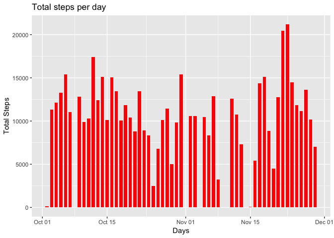
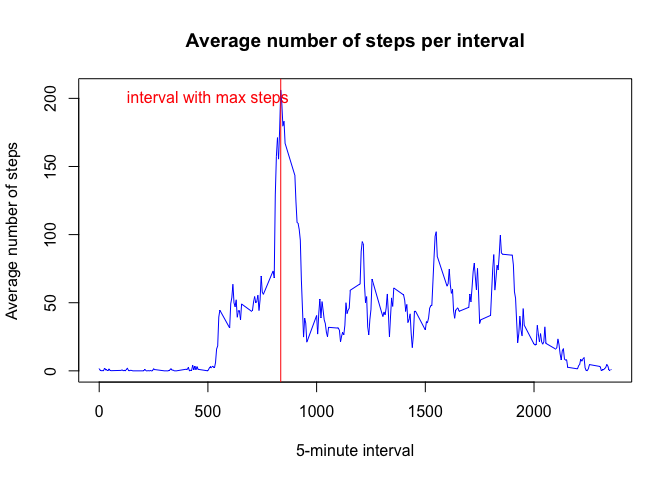
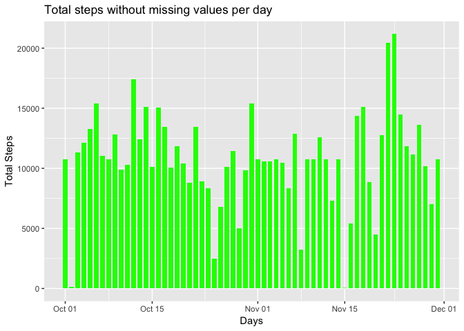
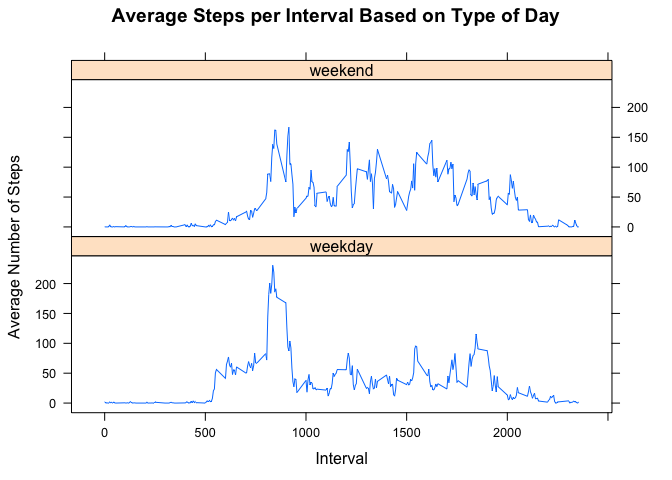

## Loading and preprocessing the data

We start first by unzipping the zip file, then we load the file into the data frame "activity" using the function read.csv(). Finally, we transform the values in column "date"
to Date objects. We do this transformation using the function mutate(), available in the "dplyr" library.


```r
library(dplyr)
```

```
## 
## Attaching package: 'dplyr'
```

```
## The following objects are masked from 'package:stats':
## 
##     filter, lag
```

```
## The following objects are masked from 'package:base':
## 
##     intersect, setdiff, setequal, union
```

```r
unzip("activity.zip", exdir = ".")
activity <- read.csv("activity.csv")
activity <- mutate(activity,date=as.Date(date,"%Y-%m-%d"))
dim(activity)
```

```
## [1] 17568     3
```

## What is mean total number of steps taken per day?

### Make a histogram of the total number of steps taken each day
We will use the function aggregate() to compute the total number of steps per day. Columns names are then renames using the function names(). Finally, we plot the data as histogram using the ggplot2 plotting system.

```r
steps.by.date <- aggregate(steps~date,data=activity,sum,na.rm=TRUE)
names(steps.by.date) <- c("date","daily.sum")
library(ggplot2)
ggplot(steps.by.date, aes(x=date,y=daily.sum)) + 
      geom_col( fill="red", size=0.5, width=0.7) + 
      labs(x = "Days") + 
      labs(y = "Total Steps") + 
      labs(title = "Total steps per day")
```

<!-- -->

### Calculate and report the mean and median total number of steps taken per day


```r
mean.daily <- mean(steps.by.date$daily.sum)
median.daily <- median(steps.by.date$daily.sum)
cat("The mean total number of steps taken per day is", round(mean.daily,digits = 0))
```

```
## The mean total number of steps taken per day is 10766
```

```r
cat("The median total number of steps taken per day is", round(median.daily,digits = 0))
```

```
## The median total number of steps taken per day is 10765
```


## What is the average daily activity pattern?

### Make a time series plot (i.e. type = "l") of the 5-minute interval (x-axis) and the average number of steps taken, averaged across all days (y-axis)


```r
steps.by.interval <- aggregate(steps~interval,data=activity,mean,na.rm=TRUE)
names(steps.by.interval) <- c("interval","avg.steps")
plot(steps.by.interval, 
     pch=20, 
     col="blue",
     main="Average number of steps per interval", 
     xlab="5-minute interval", 
     ylab="Average number of steps",
     type="l"
)
abline(v=filter(steps.by.interval, avg.steps==max(steps.by.interval$avg.steps))[1,1], col="red")
text(500, 200, "interval with max steps", col = "red") 
```

<!-- -->

```r
cat("The 5-minute interval", as.numeric(filter(steps.by.interval, avg.steps==max(steps.by.interval$avg.steps))[1,1]), "contains the maximum number of steps")
```

```
## The 5-minute interval 835 contains the maximum number of steps
```


## Imputing missing values

### Calculate and report the total number of missing values in the dataset (i.e. the total number of rows with NAs)


```r
total.na <- sum(is.na(activity$steps))
cat("There are", total.na, "missing values in the dataset")
```

```
## There are 2304 missing values in the dataset
```

### Devise a strategy for filling in all of the missing values in the dataset. Create a new dataset that is equal to the original dataset but with the missing data filled in.

The strategy chosen is to replace missing values with the average value by 5 mn interval. It's most straigthforward transformation.


```r
## Creating the new data set for which we will replace missing values
activity.na.rm <- activity
## Implemeting the strategy chosen
k <- length(activity.na.rm$steps)
for (i in 1:k) {
      if (is.na(activity.na.rm$steps[i])) {
            activity.na.rm$steps[i] <- steps.by.interval[steps.by.interval$interval== activity.na.rm$interval[i],]$avg.steps
      }
}
```


### Make a histogram of the total number of steps taken each day and Calculate and report the mean and median total number of steps taken per day. Do these values differ from the estimates from the first part of the assignment? What is the impact of imputing missing data on the estimates of the total daily number of steps?


```r
steps.by.date.new <- aggregate(steps~date,data=activity.na.rm,sum)
names(steps.by.date.new) <- c("date","daily.sum")
ggplot(steps.by.date.new, aes(x=date,y=daily.sum)) + 
      geom_col( fill="green", size=0.5, width=0.7) + 
      labs(x = "Days") + 
      labs(y = "Total Steps") + 
      labs(title = "Total steps without missing values per day")
```

<!-- -->


```r
mean.daily.new <- mean(steps.by.date.new$daily.sum)
median.daily.new <- median(steps.by.date.new$daily.sum)
cat("The mean total number of steps taken per day is", round(mean.daily.new,digits = 0))
```

```
## The mean total number of steps taken per day is 10766
```

```r
cat("The median total number of steps taken per day is", round(median.daily.new,digits = 0))
```

```
## The median total number of steps taken per day is 10766
```

The impact of missing values is extremely limited. Mean values didn't change, because I supplied interval averge for the given interval, so total average didn't change. Median values changed slightly. The Histogram changed slightly too but with the same overall trend. 


## Are there differences in activity patterns between weekdays and weekends?

### Create a new factor variable in the dataset with two levels -- "weekday" and "weekend" indicating whether a given date is a weekday or weekend day


```r
activity.na.rm$week <- as.factor(ifelse(weekdays(activity.na.rm$date) %in% 
                              c("Saturday", "Sunday"), "weekend", "weekday"))
```
The new factor variable is called **week** and has the requested levels 2 levels "weekday, weekend"

### Make a panel plot containing a time series plot (i.e. type = "l") of the 5-minute interval (x-axis) and the average number of steps taken, averaged across all weekday days or weekend days (y-axis)


```r
## First we group the data by interval and week
x <- group_by(activity.na.rm,interval,week)
## We then apply the mean function
x <- summarize_each(x[,c(1,3,4)], funs(mean))
```

```
## `summarise_each()` is deprecated.
## Use `summarise_all()`, `summarise_at()` or `summarise_if()` instead.
## To map `funs` over all variables, use `summarise_all()`
```

```r
## We are going to use lattice to plot the 2 lines
library(lattice)
xyplot(steps ~ interval | week, 
       data = x, 
       layout = c(1, 2), 
       main="Average Steps per Interval Based on Type of Day", 
       ylab="Average Number of Steps", 
       xlab="Interval",
       type="l")
```

<!-- -->

**We observe that activity on the weekends tends to be more spread out over the day compared to the weekdays. This could be due to the fact that activities on weekdays mostly follow a work related routine, whereas weekends tend to be more random.**
